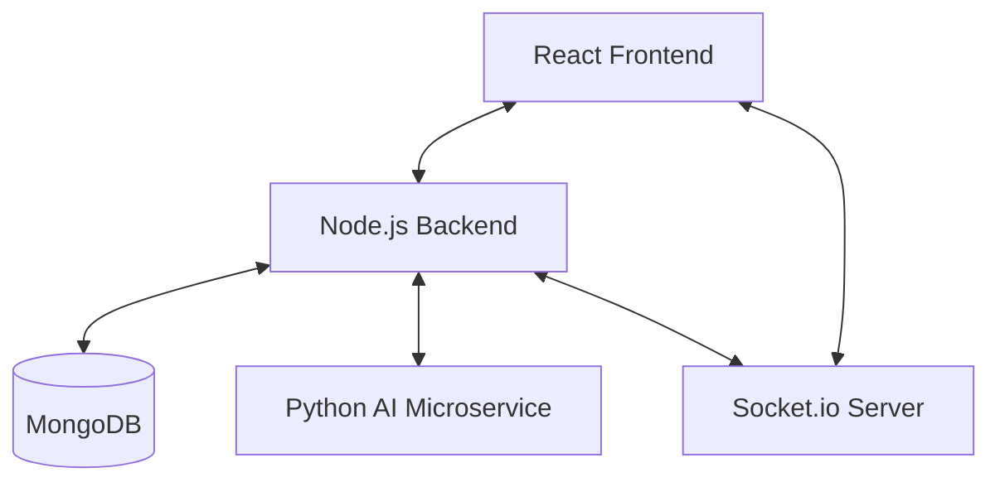
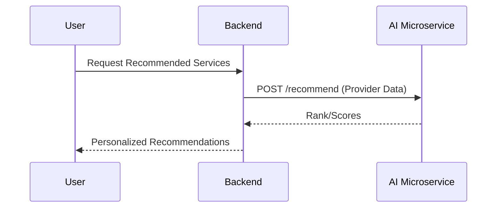

# 🏠 SuvidhaAi — Full Project Documentation

SuvidhaAi is a production-ready, hyperlocal marketplace platform designed to connect users with trusted local service providers (plumbers, electricians, tutors, cleaners, etc.). It leverages AI-powered recommendations, real-time chat, and a robust microservice architecture to provide a seamless experience for users, providers, and administrators.

---

## 🚀 Key Features

### 👤 For Users
- **Service Discovery**: Browse and search for services by category and location.
- **AI Recommendations**: Personalized provider rankings based on proximity, rating, and availability.
- **Geospatial Search**: Find the nearest providers using interactive OpenStreetMap/Leaflet components.
- **Real-time Chat**: Direct communication with providers after booking.
- **Booking Management**: Schedule, track, and manage service requests.
- **Verified Reviews**: Submit feedback with AI-powered fake review detection.

### 🛠️ For Providers
- **Professional Dashboard**: Manage service listings, track earnings, and view booking history.
- **Real-time Notifications**: Instant alerts for new bookings and messages via Socket.io.
- **Availability Toggle**: Control when you are visible for new requests.
- **Chat Interface**: Stay connected with clients through a dedicated chat workspace.

### 👑 For Admins
- **Platform Analytics**: High-level overview of users, providers, bookings, and revenue.
- **User Management**: Ability to toggle user/provider status.
- **Content Moderation**: Verify providers and remove spam or suspicious listings.

---

## 🛠️ Tech Stack

| Layer | Technology | Description |
|-------|------------|-------------|
| **Frontend** | React 18 + Vite | Modern, fast UI development with optimized builds. |
| **Styling** | Tailwind CSS | Utility-first CSS for responsive and premium design. |
| **Backend** | Node.js + Express.js | Scalable REST API handling core logic and business rules. |
| **Database** | MongoDB + Mongoose | NoSQL database for flexible data modeling and geospatial queries. |
| **Real-time** | Socket.io | Bi-directional communication for chat and live updates. |
| **AI Service** | Python + FastAPI | Specialized microservice for heavy ML and NLP computing. |
| **Auth** | JWT + bcryptjs | Secure authentication and password hashing. |
| **Maps** | Leaflet.js | Free, open-source mapping integration using OpenStreetMap. |

---

## 🏗️ System Architecture

### High-Level Architecture
SuvidhaAi follows a modular **Microservice-lite** architecture, where the core business logic is handled by a Node.js backend, and intelligent features are offloaded to a Python-based AI service.



### AI Integration Flow
The Backend acts as an orchestrator, calling the AI microservice whenever an intelligent decision is needed (e.g., ranking providers or validating a review).



---

## 🤖 AI Core: How it Works

The AI component is the heart of SuvidhaAi, providing four main intelligent features:

### 1. Provider Recommender Engine (`recommender.py`)
Uses a **Weighted Scoring Formula** to rank providers. The score (0.0 to 1.0) is calculated as:
- **Proximity (30%)**: Normalized Haversine distance (1 / (1 + distance_km)).
- **Rating (30%)**: Scaled provider rating (rating / 5.0).
- **Availability (20%)**: Binary 1.0 for online, 0.0 for offline.
- **Experience (20%)**: Normalized against a baseline of 25 completed jobs.

### 2. Fake Review Detector (`fake_review_detector.py`)
Employs a **Hybrid Hybrid Classification** approach:
- **Heuristics**: Checks for excessive ALL CAPS, word repetition, or extremely short comments.
- **ML Model**: A TF-IDF Vectorizer (unigrams + bigrams) combined with **Logistic Regression** trained on labeled customer feedback to detect patterns of suspicious activity.

### 3. Demand Predictor (`demand_predictor.py`)
A **Random Forest Regressor** model that predicts platform demand based on:
- **Weather Context** (Temperature, Precipitation).
- **Temporal Context** (Time of day, Day of week).
- **Service Category**.
*Helps in dynamic pricing insights and supply-side planning.*

### 4. Weather-Driven Recommendations (`main.py`)
A rule-based intelligence layer that suggests services based on current conditions:
- **Hot (>30°C)**: AC Repair, Electricians.
- **Rainy/Snowy**: Plumbers, Roof Repair, Mechanics.
- **Cold (<15°C)**: Electricians.

---

## 🔄 Data Pipeline

### Booking Pipeline
1. **Selection**: User selects a service and provider (aided by AI scores).
2. **Persistence**: Booking is saved in MongoDB with status `pending`.
3. **Notification**: Socket.io emits a `new_booking` event to the provider.
4. **Chat Initiation**: A unique `bookingId` room is created for real-time messaging.
5. **Completion**: Upon service delivery, provider marks it `completed`.

### Review Pipeline
1. **Submission**: User submits a comment and rating.
2. **AI Validation**: Backend sends comment to AI `/review-check`.
3. **Classification**: AI returns `genuine` or `suspicious` with a confidence score.
4. **Moderation**: Genuine reviews are live; suspicious ones are flagged for Admin review.

---

## ⚙️ Setup & Installation

### 1. Requirements
- Node.js (v18+)
- Python (v3.10+)
- MongoDB (Local instance or Atlas)

### 2. Backend
```bash
cd backend
npm install
npm run seed  # Preloads demo data
npm run dev
```

### 3. AI Service
```bash
cd ai-service
python -m venv venv
# Activate venv: .\venv\Scripts\activate (Windows) or source venv/bin/activate (Mac/Linux)
pip install -r requirements.txt
python main.py
```

### 4. Frontend
```bash
cd frontend
npm install
npm run dev
```

---

## 📡 API Reference Summary

- `POST /api/auth/register` : User/Provider signup.
- `GET /api/services` : Search with geospatial filters.
- `GET /api/providers/recommend` : Returns AI-ranked providers.
- `POST /api/bookings` : Create a service request.
- `POST /api/reviews` : Submit AI-validated feedback.
- `GET /api/admin/stats` : Platform analytics for administrators.

---

*Documentation generated for SuvidhaAi v1.0 — Architecture for a better hyperlocal experience.*
